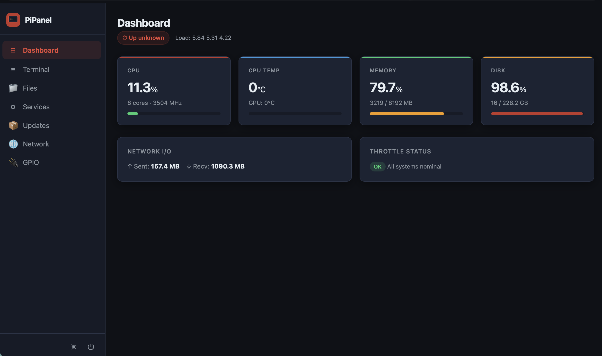

# 🖥️ PiPanel

<div align="center">

**A beautiful, all-in-one web dashboard for your Raspberry Pi 5.**
Manage your Pi from any browser on your network — no SSH, no headache.

[](LICENSE)
[](https://python.org)
[](https://www.raspberrypi.com/products/raspberry-pi-5)
[](https://www.raspberrypi.com/products/raspberry-pi-4-model-b)
[](https://github.com/Gityus13/pipanel)



</div>

---

## ✨ Features

| Feature | Description |
|---|---|
| 📊 **System Dashboard** | Real-time CPU, RAM, disk, GPU temp, throttle alerts — Pi 5 native |
| 🖥️ **Web Terminal** | Full terminal in your browser. No SSH client needed |
| 📁 **File Manager** | Browse, upload, download, rename, delete files |
| ⚙️ **Service Manager** | Start/stop/restart systemd services, view live logs |
| 📦 **Package Updates** | See and apply `apt` updates with one click |
| 🌐 **Network Scanner** | See every device on your LAN with names and ping |
| 🔌 **GPIO Monitor** | Live pin states, directions, and values (Pi 5 native) |
| 🌗 **Dark / Light Mode** | Toggle between themes |
| 🔒 **Password Protected** | Simple password auth, set on first run |

---

## 🚀 One-Line Install

```bash
curl -sSL https://raw.githubusercontent.com/Gityus13/pipanel/main/install.sh | bash
```

Then open your browser and go to:

```
http://<your-pi-ip>:8080
```

> **Note:** Designed for Raspberry Pi 5 running Raspberry Pi OS (Bookworm). Pi 4 also works but GPIO monitoring uses Pi 5 API.

---

## 📦 Manual Install

```bash
git clone https://github.com/Gityus13/pipanel.git
cd pipanel
chmod +x install.sh
./install.sh
```

---

## 🔧 Configuration

Config is stored at `~/.pipanel/config.json`. You can edit it manually or through the Settings page in the UI.

| Option | Default | Description |
|---|---|---|
| `port` | `8080` | Web server port |
| `host` | `0.0.0.0` | Bind address |
| `theme` | `dark` | Default theme (`dark` / `light`) |
| `auth_enabled` | `true` | Enable password protection |

---

## 🛠️ Running Manually

```bash
# Start
pipanel start

# Stop
pipanel stop

# Status
pipanel status

# Restart
pipanel restart

# View logs
pipanel logs
```

Or with systemd directly:

```bash
sudo systemctl start pipanel
sudo systemctl status pipanel
```

---

## 🔄 Update

```bash
pipanel update
```

Or manually:

```bash
cd pipanel
git pull
pip install -r requirements.txt --upgrade
sudo systemctl restart pipanel
```

---

## 🗑️ Uninstall

```bash
pipanel uninstall
```

---

## 🤝 Contributing

Pull requests are welcome! Please read [CONTRIBUTING.md](CONTRIBUTING.md) first.

1. Fork the repo
2. Create your feature branch: `git checkout -b feature/amazing-feature`
3. Commit: `git commit -m 'Add amazing feature'`
4. Push: `git push origin feature/amazing-feature`
5. Open a Pull Request

---

## 📄 License

MIT — see [LICENSE](LICENSE)

---

<div align="center">
Made with ❤️ by <a href="https://github.com/Gityus13">Gityus13</a> for the Raspberry Pi community
</div>
